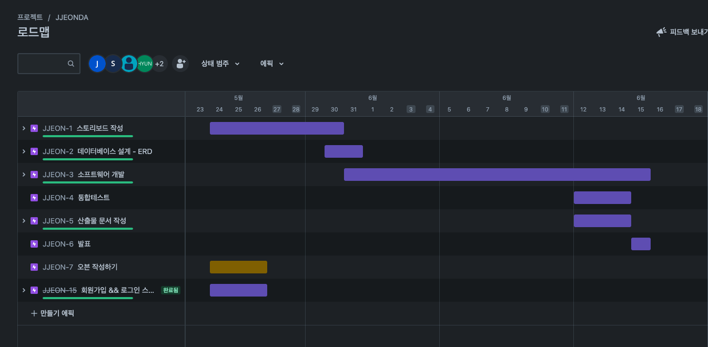
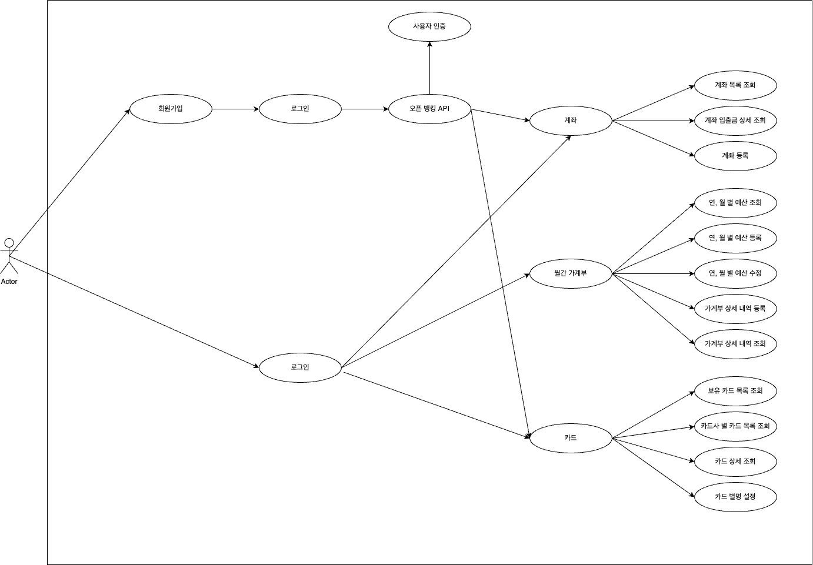

# 프로젝트 소개

오픈뱅킹 API를 활용한 개인 통합 자산 관리 플랫폼

# 프로젝트 개발 기간

2023.05.24 ~ 2023.06.15 (1차 개발 완료)

2023.06.19 ~ (Refactoring)

1차 로드맵

# 1차 개발 내용

- 각 기능 별 CRUD
  - 기능 1 : 로그인 및 회원가입
  - 기능 2 : 가계부
  - 기능 3 : 잔액조회
  - 기능 4 : 카드

# 프로젝트 사용 기술

 
<h3>Development</h3>

<h4>Back-End</h4>

 

<h4>Front-End</h4>

 
 
 
 

<h3>Tools</h3>

 

# 프로젝트 ERD

---

# 프로젝트 유스케이스

---

